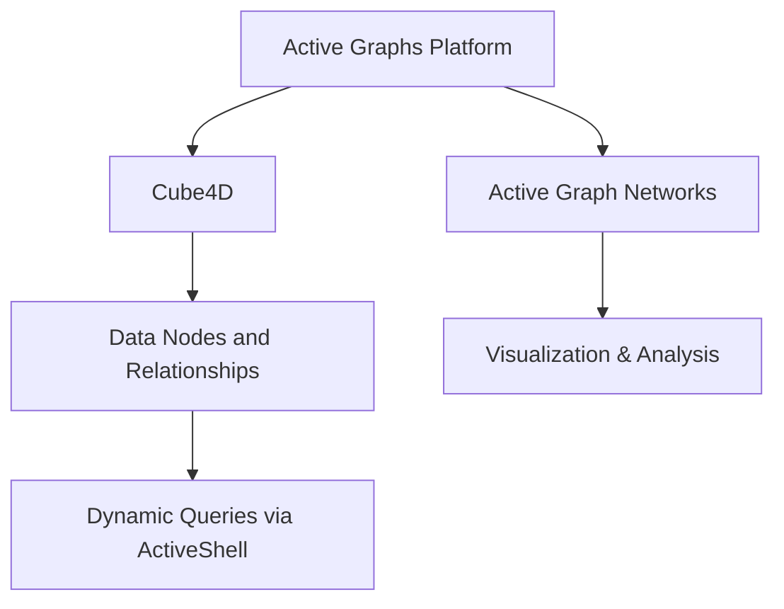

**Active Graphs: Product Overview**

---

### Overview
Active Graphs represents a groundbreaking evolution in the way data relationships and temporal flows are understood and manipulated. Unlike traditional data models that flatten relationships or rely on static hierarchies, Active Graphs leverages the power of multi-dimensional structures, enabling users to explore, analyze, and act on data with unprecedented clarity and depth.

The platform is designed to adapt, grow, and evolve alongside the data it manages, offering seamless integration across use cases such as healthcare, finance, logistics, and beyond.

---

### Key Components

#### **1. Active Graphs**
- **Description:**
  The foundational platform for mapping multi-dimensional relationships in data.
  
- **Functionality:**
  - Structures data hierarchically across the X and Y axes.
  - Maps temporal layers along the Z axis.
  - Handles dynamic relationships between entities such as patients, scenarios, or timeseries data.

- **Example Use Case:**
  Mapping healthcare patient records to track conditions, interventions, and outcomes over time.

---

#### **2. Active Graph Networks**
- **Description:**
  The boundary layer generated by the relationships and connections within the hypercube.
  
- **Functionality:**
  - Captures the interplay between data entities.
  - Allows for visualization and manipulation of complex relationships.
  - Generates actionable insights by highlighting previously hidden connections.

---

#### **3. Cube4D**
- **Description:**
  Padded tensors used to structure and store data within a hypercube format.
  
- **Functionality:**
  - Dynamically grows and evolves in size based on time progression or Dynamic Relationship Expansion (DRE).
  - Supports stacking and querying of independent cubes.
  - Maintains data integrity across multi-dimensional planes.

- **Example Use Case:**
  Finance systems tracking transactions, client profiles, and market conditions in real-time.

---

#### **4. ActiveShell**
- **Description:**
  A powerful and intuitive query mechanism that bridges the gap between technical users and actionable intelligence.

- **Functionality:**
  - Facilitates commands like get, set, add, create, and destroy.
  - Leverages a Noun-Verb-Truth syntax for clarity and simplicity.
  - Supports querying from a root cube to any other cube in the structure.

- **Example Query:**
  ```plaintext
  Get-Node-Patient -Condition Diabetes | ? { $_.BG.mmol -gt 15 }
  ```

---

### Features

- **Dynamic Growth:**
  - Data structures evolve in real-time as new relationships or data points are added.

- **Universal Compatibility:**
  - Integrates seamlessly with PowerShell, NetworkX, Neo4j, and existing data systems.

- **Scalability:**
  - Capable of scaling from individual datasets to global-scale systems.

- **Actionable Intelligence:**
  - Provides users with the tools to uncover insights and make decisions without requiring deep technical expertise.

---

### Benefits

- **Empowerment Through Transparency:**
  - Active Graphs makes complex relationships visible and understandable.

- **Time Efficiency:**
  - Reduces the effort required to extract actionable insights from data.

- **Flexibility Across Domains:**
  - Applicable to diverse industries such as healthcare, finance, logistics, and research.

- **Future-Proof:**
  - Designed to adapt to emerging technologies and data challenges.

---

### Sample Diagram



---

### Use Cases

#### **Healthcare**
- Tracking patient records, conditions, and treatments over time.
- Enabling real-time insights for improving patient outcomes.

#### **Finance**
- Monitoring transactions and market conditions.
- Identifying trends and anomalies in financial data.

#### **Logistics**
- Mapping supply chain relationships and dependencies.
- Optimizing routes, schedules, and inventory levels.

---

### Call to Action
Active Graphs is not just a product—it’s a paradigm shift. Join us as we redefine what’s possible with data. For inquiries, demonstrations, or collaborations, contact us today to explore how Active Graphs can revolutionize your approach to data intelligence.