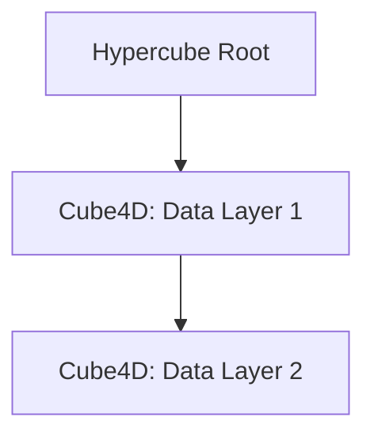

# ActiveGraph Networks, Cube4D, and ActiveShell: Redefining Multi-Dimensional Intelligence

## Abstract
In an era dominated by overwhelming data and complex relationships, understanding multi-dimensional structures is critical. Traditional frameworks fall short when tasked with capturing the depth and evolution of dynamic systems. This whitepaper introduces a groundbreaking approach combining **Active Graph Networks**, **Cube4D**, and **ActiveShell** to transcend current paradigms. By integrating hierarchical relationships, temporal layers, and intuitive querying mechanisms, this system enables scalable, transparent, and actionable intelligence.

---

## Introduction
Data systems today struggle to represent relationships beyond basic connections, leaving multi-dimensional insights untapped. ActiveGraph Networks and Cube4D provide a framework that organizes and evolves relational data dynamically, while ActiveShell serves as an intuitive query mechanism to empower users. Together, they offer a unified system for exploring the uncharted territories of multi-dimensional data relationships.

---

## Problem Statement
- Traditional graph databases lack scalability for real-time and evolving relationships.
- Tensor-based systems fail to provide actionable querying mechanisms.
- Current frameworks are inefficient for managing hierarchical and temporal data simultaneously.

---

## The Framework
### ActiveGraph Networks: Mapping Multi-Dimensional Relationships
ActiveGraph Networks map and structure relationships dynamically. Relationships are structured hierarchically across:
- **X-axis**: Entities (e.g., Patient IDs, user nodes).
- **Y-axis**: Scenarios or context-specific layers.
- **Z-axis**: Temporal data (e.g., time-series data).

These networks represent the boundary layer of a hypercube, offering an evolving skeleton for structured data exploration.

### Cube4D: The Universal Data Structure
Cube4D encapsulates structured data as **padded tensors** within a hypercube. Key features include:
- **Dynamic Scaling**: Cubes grow as new data or relationships are added.
- **Temporal Evolution**: Dimensions extend in real-time or based on Dynamic Relationship Expansion (DRE).
- **Stackable Design**: Cubes can be queried independently or stacked for aggregate analysis.

Cube4D ensures seamless integration between structure and data, bridging the gap between static representations and evolving systems.

### ActiveShell: Querying with Precision
ActiveShell provides the mechanism to interact with ActiveGraph Networks and Cube4D. Its intuitive syntax enables:
- **Get**: Retrieve nodes, edges, or relationships.
- **Set**: Update data or create new relationships.
- **Add/Create**: Expand the dataset by adding new dimensions or entities.
- **Destroy**: Remove outdated or irrelevant data.

#### Example Query:
```plaintext
Get-Node-Patient -Condition Diabetes | ? { $_.BG.mmol -gt 15 }
```
This query retrieves diabetic patients with blood glucose levels exceeding a threshold, illustrating the seamless interaction between dimensions.

---

## Implementation
### Dynamic Graph Relationships
Mermaid diagrams illustrate the relationship hierarchy and flow within ActiveGraph Networks.


### Cube4D Hypercube Structure

---

## Applications
### Use Cases
1. **Healthcare**: Patient data analysis with temporal tracking.
2. **Finance**: Risk modeling with real-time relational updates.
3. **Logistics**: Supply chain optimization using hierarchical mapping.

### Industry Impact
- **Scalability**: From small organizations to enterprise-scale systems.
- **Accessibility**: Low computational overhead compared to traditional AI models.
- **Actionability**: Rapid insight generation with minimal technical overhead.

---

## Conclusion
ActiveGraph Networks, Cube4D, and ActiveShell redefine how we interact with data. This system offers a scalable, intuitive, and transparent framework for solving complex, multi-dimensional problems. As we embrace dynamic intelligence, this paradigm shift will drive innovation across industries.

For inquiries, collaboration, or access to implementation examples, visit [ActiveGraph Networks](https://github.com/ConicuConsulting/ActiveGraphNetworks).

---
